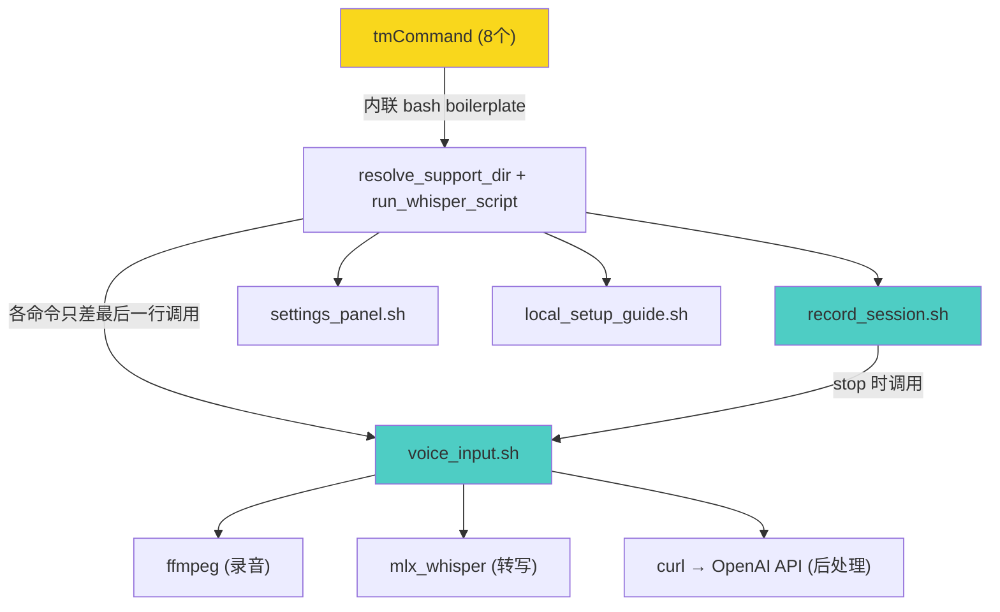

# textmate-whisper 架构审阅

## 总评

项目思路清晰：一个 local-first 的 TextMate 语音输入 bundle，用 bash 粘合 ffmpeg + mlx_whisper + 可选的 OpenAI 后处理。功能完整，fail-open 设计合理，README 质量很高。

但从工程视角看，有一个 **结构性问题** 和若干值得注意的点。

---

## 🔴 核心问题：两个脚本之间的大量重复

[voice_input.sh](file:///Users/admin/GitProjects/textmate-whisper/templates/Support/bin/voice_input.sh) (514 行) 和 [record_session.sh](file:///Users/admin/GitProjects/textmate-whisper/templates/Support/bin/record_session.sh) (589 行) 共享了约 **200+ 行**完全相同的代码：

| 重复函数/段 | 行数 |
|---|---|
| [append_log()](file:///Users/admin/GitProjects/textmate-whisper/templates/Support/bin/voice_input.sh#33-38) | ~5 |
| [show_tip_and_exit()](file:///Users/admin/GitProjects/textmate-whisper/templates/Support/bin/record_session.sh#39-56) | ~15 |
| [resolve_bin()](file:///Users/admin/GitProjects/textmate-whisper/templates/Support/bin/voice_input.sh#64-90) | ~25 |
| [trim_inline_space()](file:///Users/admin/GitProjects/textmate-whisper/templates/Support/bin/voice_input.sh#138-144) | ~5 |
| [strip_wrapping_quotes()](file:///Users/admin/GitProjects/textmate-whisper/templates/Support/bin/voice_input.sh#145-157) | ~12 |
| [load_config_env()](file:///Users/admin/GitProjects/textmate-whisper/templates/Support/bin/voice_input.sh#158-185) | ~25 |
| [is_truthy()](file:///Users/admin/GitProjects/textmate-whisper/templates/Support/bin/record_session.sh#128-140) | ~12 |
| [status_notify()](file:///Users/admin/GitProjects/textmate-whisper/templates/Support/bin/voice_input.sh#104-126) | ~20 |
| [list_audio_devices_raw()](file:///Users/admin/GitProjects/textmate-whisper/templates/Support/bin/record_session.sh#242-245) | ~3 |
| [list_audio_devices()](file:///Users/admin/GitProjects/textmate-whisper/templates/Support/bin/voice_input.sh#190-204) | ~15 |
| [pick_audio_device_index()](file:///Users/admin/GitProjects/textmate-whisper/templates/Support/bin/voice_input.sh#205-211) | ~5 |
| [validate_and_resolve_input_device()](file:///Users/admin/GitProjects/textmate-whisper/templates/Support/bin/voice_input.sh#212-266) | ~50 |
| 顶层配置加载和 LOG 初始化 | ~15 |

[list_input_devices.sh](file:///Users/admin/GitProjects/textmate-whisper/scripts/list_input_devices.sh) 里的 awk 解析又出现了第三份拷贝。

> [!CAUTION]
> 这不只是"代码味道"——它是维护风险。修一个 bug 要改三处，漏一处就是回归。

**Unix 哲学的解法**：提取一个 `_common.sh`（或 `lib.sh`），两个主脚本开头 `source` 它：

```bash
# voice_input.sh / record_session.sh 开头
SCRIPT_DIR="$(cd "$(dirname "${BASH_SOURCE[0]}")" && pwd)"
. "$SCRIPT_DIR/_common.sh"
```

[list_input_devices.sh](file:///Users/admin/GitProjects/textmate-whisper/scripts/list_input_devices.sh) 也可以 source 同一个 lib 里的设备解析函数。

---

## 🟡 tmCommand 模板层的重复

8 个 [.tmCommand](file:///Users/admin/GitProjects/textmate-whisper/templates/Commands/Voice%20Dictation%20-%20Insert.tmCommand) 文件里，每一个都内联了完全相同的 ~50 行 bash（`resolve_support_dir` + [show_tip](file:///Users/admin/GitProjects/textmate-whisper/templates/Support/bin/record_session.sh#39-56) + `run_whisper_script`），只有最后一行调用不同：

```
run_whisper_script "voice_input.sh" --mode insert      # Insert
run_whisper_script "voice_input.sh" --mode replace      # Replace
run_whisper_script "record_session.sh" --action start   # Start Recording
...
```

**建议**：把这个 boilerplate 提取到 `Support/bin/bootstrap.sh`，tmCommand 内联脚本缩减为：

```bash
#!/usr/bin/env bash
"$(cd "$(dirname "${BASH_SOURCE[0]}")/../Support/bin" && pwd)/bootstrap.sh" \
  voice_input.sh --mode insert
```

TextMate 的 `$TM_BUNDLE_SUPPORT` 环境变量本来就指向 `Support/`，甚至可以更短。这样改完每个 tmCommand 的内联脚本只有 2-3 行。

---

## 🟡 [show_tip_and_exit()](file:///Users/admin/GitProjects/textmate-whisper/templates/Support/bin/record_session.sh#39-56) 在两个脚本里行为不一致

| | [voice_input.sh](file:///Users/admin/GitProjects/textmate-whisper/templates/Support/bin/voice_input.sh) | [record_session.sh](file:///Users/admin/GitProjects/textmate-whisper/templates/Support/bin/record_session.sh) |
|---|---|---|
| 非 TextMate 环境退出码 | `exit 1` | `exit 0` |
| 判断是否在 TextMate 内 | 检查 `TM_BUNDLE_SUPPORT`/`TM_SCOPE`/`TM_SELECTED_TEXT` | 不检查，一律 `exit 0` |

[record_session.sh](file:///Users/admin/GitProjects/textmate-whisper/templates/Support/bin/record_session.sh) 版本永远 `exit 0`，意味着即使出错，从 shell 直接调用时返回成功。这会导致脚本在 pipeline 中吞错误。统一后这种分歧自然消失。

---

## 🟢 做得好的地方

1. **fail-open 设计**：API 挂了回退原始 transcript，不阻塞用户。
2. **模型 fallback**：`whisper-tiny` 作为后备，404 时自动降级。
3. **状态机设计**：[record_session.sh](file:///Users/admin/GitProjects/textmate-whisper/templates/Support/bin/record_session.sh) 用文件锁（`active_session.env`）+ PID 检测实现了带 stale cleanup 的会话管理，比用 `/tmp` PID 文件优雅。
4. **窗口标题指示器**：`🔴 REC...` / `🟡 AI...` prefix 是极好的 UX 细节。
5. **install.sh 自带验证**：安装后立即 `plutil -lint` + `bash -n` 校验，阻止坏 bundle 进入 TextMate。
6. **config 白名单**：`load_config_env` 只 export 白名单 key，不 eval 任意行，安全。

---

## 🔵 次要建议（按优先级）

### 1. `trim_text_file()` 不需要 python3

```bash
# 当前：fork python3 只为 strip 文本
trim_text_file() {
  python3 - "$file" <<'PY'
  ...
  PY
}
```

可以纯 bash：

```bash
trim_text_file() {
  local content
  content="$(<"$1")"
  content="${content#"${content%%[![:space:]]*}"}"
  content="${content%"${content##*[![:space:]]}"}"
  printf '%s' "$content"
}
```

或用 `sed`。每次调用省一个 python3 fork（~30ms）。

### 2. `postprocess_openai()` 的 JSON 构造用 python3 是对的

这里 python3 用 `json.dumps` 处理转义是正确选择——用 bash 拼 JSON payload 是自找麻烦。保持不变。

### 3. smoke.sh 只做了语法检查

`bash -n` 和 `plutil -lint` 只校验语法，不跑任何逻辑。可以加一个 `--dry-run` 模式到 `voice_input.sh`，让 smoke test 能走到配置加载和 PATH 解析那一步，不碰麦克风。

### 4. `audio_duration_seconds()` 依赖 `ffprobe` 但没声明

`record_session.sh` 里用了 `ffprobe`，但 README 和 `resolve_bin` 都没把 `ffprobe` 当依赖处理。`ffprobe` 通常和 `ffmpeg` 一起安装，但如果有人用精简版 ffmpeg，这里会 silent fail（返回 `0`），导致短录音被误判为"too short"而丢弃。

### 5. `.gitignore` 只有 18 bytes

大概只有 `.DS_Store`。建议加上 `*.wav`、`*.log` 之类，防止误提交测试录音。

---

## 架构图



> 黄色 = 重复最严重的层；青色 = 核心逻辑

---

## 行动清单

| 优先级 | 项目 | 影响 |
|---|---|---|
| P0 | 提取 `_common.sh`，消除 `voice_input.sh` / `record_session.sh` / `list_input_devices.sh` 之间的重复 | 减少 ~200 行重复，修 bug 只改一处 |
| P1 | 提取 tmCommand boilerplate 到 `bootstrap.sh` | 减少 8× ~50 行重复 |
| P1 | 统一 `show_tip_and_exit` 行为 | 修复静默吞错误 |
| P2 | `trim_text_file` 去 python3 依赖 | 微小性能提升 |
| P2 | smoke.sh 添加 dry-run 逻辑路径测试 | 提高测试覆盖 |
| P3 | 补充 `.gitignore` | 卫生 |
